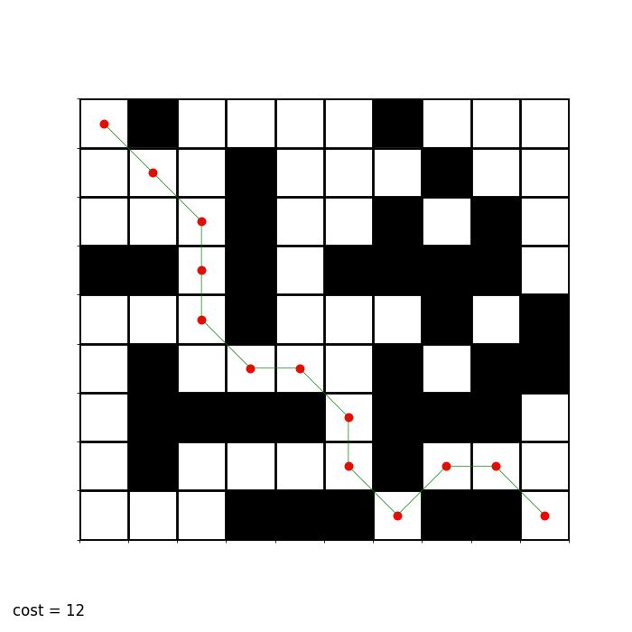

---

# Maze Solver Using A* Algorithm

This project implements the A* algorithm to solve a maze. The algorithm finds the shortest path from the top-left corner (start) to the bottom-right corner (goal) of a given maze grid. The grid consists of passable and impassable cells, where the algorithm tries to find the least costly path while avoiding obstacles.

## Features

- **A* Algorithm**: Utilizes the A* search algorithm with Euclidean distance as the heuristic.
- **Visualization**: The solution path is visualized using matplotlib, with the grid and path shown in an image.
- **Custom Input**: You can input your maze structure via the console.

## Installation

1. **Clone the repository:**
   ```bash
   git clone https://github.com/yourusername/maze-solver-astar.git
   cd maze-solver-astar
   ```

2. **Install the required Python packages:**
   ```bash
   pip install matplotlib numpy
   ```

## How to Run

1. Run the script:
   ```bash
   python mazeAstar.py
   ```

2. Input the maze as a series of rows (1 for passable, 0 for impassable). For example:
   ```
   the number of rows? 9
   write the 1th row: 1 0 1 1 1 1 0 1 1 1
   write the 2th row: 1 1 1 0 1 1 1 0 1 1
   write the 3th row: 1 1 1 0 1 1 0 1 0 1
   ...
   ```

3. The program will display the shortest path found by the A* algorithm.

## Example

Here is an example of the maze solution:



The cost of the path in this example is **12**.

## How it Works

- **Maze Input**: The maze is input as a grid of 0s and 1s, where 1 represents passable cells and 0 represents obstacles.
- **Neighbors**: The algorithm considers horizontal, vertical, and diagonal movements.
- **Heuristics**: The Euclidean distance from the current point to the goal is used as the heuristic function.
- **Path Visualization**: The shortest path is displayed with red dots for the path and green lines connecting them.

## License

This project is licensed under the MIT License.

---
